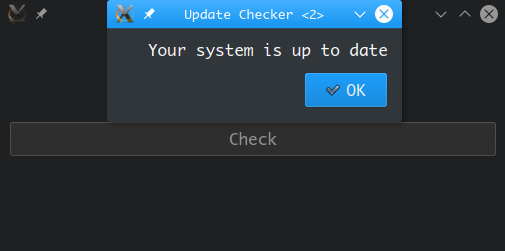

Python ile programlara güncelleme kontrolü yapabilirsiniz.

Basit bir yapısı var. Ben PyQt ile deneme şeyi ayarladım. checker.py içinden bakılabilir. static ile update.xml dosyasını serve ediyorum. Zaten main içerisinde de URL adresini görebilirsiniz. Ben static dosyasını ve o URL'yi deneme için öyle ekledim. Siz farklı olarak da eklersiniz yani.

getVersion ve getMessage işlevlerini oluşturdum ama getVersion ile de mesaj çekebilirsiniz. Sadece anlamına göre iş yapsın diye böyle bir şey yaptım.

Güncel bir sistemde şöyle gösteriyor:

